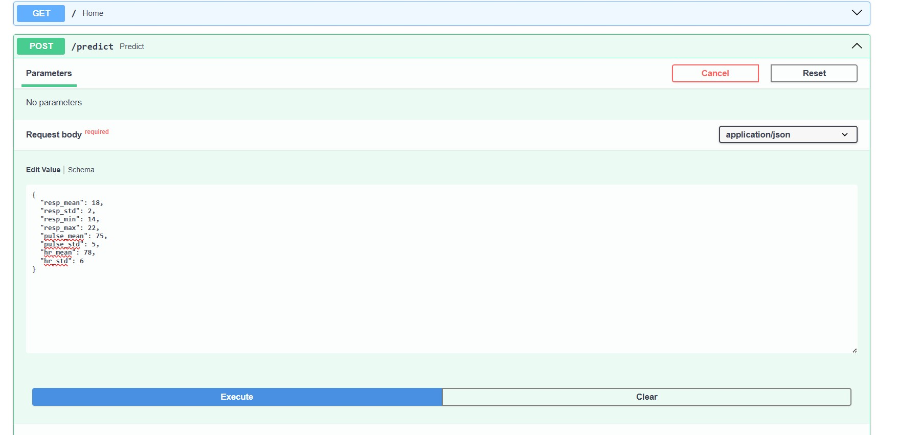
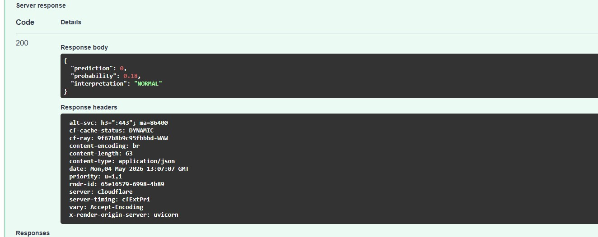
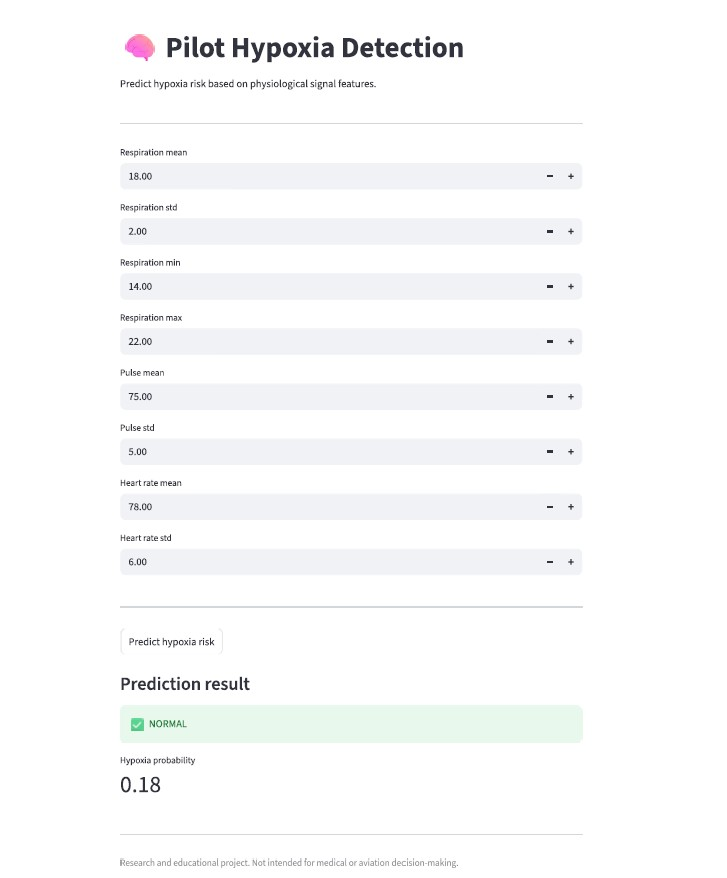

# 🧠 Pilot Hypoxia Detection using Physiological Signals - End-to-end machine learning project for hypoxia risk detection using physiological signal features, with deployed API and interactive dashboard.

## 📌 Overview

This project presents a machine learning system for detecting hypoxia risk based on physiological signals such as respiration, pulse, heart rate, and oxygen saturation.

The goal is to support safety-critical environments (e.g., aviation) by enabling early detection of oxygen deprivation patterns.

---


---

## 🌍 Live Demo

Try the API here:

👉 https://pilot-hypoxia-detection-using.onrender.com/docs

---

## 🎯 Project Value

Hypoxia can significantly impair cognitive function and reaction time, which is critical in safety-sensitive environments such as aviation.

This project demonstrates how physiological signals can be transformed into actionable risk predictions using machine learning and deployed as both an API and an interactive dashboard.

---
## ✅ What I Built

* End-to-end machine learning pipeline
* Feature extraction from physiological time-series signals
* Random Forest classification model
* FastAPI prediction API
* Streamlit interactive dashboard
* Deployment-ready project

---

## 📊 Data

The model is trained on physiological signals from the BIDMC dataset (https://physionet.org/content/bidmc/1.0.0/):

* SpO₂ (oxygen saturation)
* Heart rate (HR)
* Respiration (RESP)
* Pulse

The data consists of time-series recordings collected from clinical monitoring systems.

The dataset was processed into fixed-size windows to extract statistical features.

The model was trained on 108 samples with 8 engineered features.

---

## Potential Applications

This project demonstrates how physiological signal analysis and machine learning can be used for early hypoxia risk detection in safety-critical environments.

Potential real-world applications include:

- **Aviation safety**
  - Monitoring pilot physiological status during high-altitude flight, reduced cabin pressure, or oxygen system failure scenarios.
  - Supporting early warning systems for hypoxia-related cognitive impairment.

- **Critical care and hospital monitoring**
  - Continuous monitoring of ICU or high-risk patients using physiological signal trends rather than isolated measurements.
  - Early detection of respiratory deterioration before severe oxygen desaturation occurs.

- **Wearable health technologies**
  - Integration into smartwatches, biosensors, or portable monitoring devices for real-time physiological risk assessment.

- **Remote patient monitoring**
  - Detection of abnormal respiratory or cardiovascular patterns in telemedicine environments and home-care systems.

- **Emergency and military medicine**
  - Physiological monitoring in extreme environments such as high altitude, aerospace operations, or combat medicine.

- **Clinical decision support research**
  - Exploration of machine learning approaches for physiological state classification using non-invasive biosignals.

- **Human performance monitoring**
  - Tracking physiological fatigue and oxygen-related stress in high-performance or operational environments.

This project also demonstrates how machine learning models can be transformed into deployable healthcare-oriented systems through APIs and interactive dashboards.

Importantly, this project is intended for educational and research purposes only and is not validated for clinical or operational use.

---
## ⚙️ Feature Engineering

Statistical features were extracted from physiological signals using fixed-size time windows:

**Respiration:**

* mean
* standard deviation
* minimum
* maximum

**Pulse:**

* mean
* standard deviation

**Heart Rate:**

* mean
* standard deviation

These features capture variability and distribution patterns in physiological signals rather than relying on single-point measurements.

---

## 🤖 Model

* Algorithm: Random Forest Classifier

**Features:**

* resp_mean
* resp_std
* resp_min
* resp_max
* pulse_mean
* pulse_std
* hr_mean
* hr_std

The model predicts the probability of hypoxia based on physiological signal patterns.

---

## 📈 Results

* Accuracy: ~0.95 (on training/validation split)

The model demonstrates strong performance in distinguishing normal vs hypoxia conditions based on statistical signal features.


---

## 🧠 Key Insights

* Variability in respiration is a strong indicator of physiological state
* Pulse and heart rate patterns contribute significantly to prediction
* Aggregated statistical features outperform raw signal values

---

## 🚀 Future Improvements

* Integration of additional publicly available physiological datasets
* Real-time monitoring system for continuous signal analysis
* Visualization dashboard for physiological trends
* Explainable AI techniques (e.g., SHAP) for model interpretability
* Deployment as a scalable web service

---

## 🛠️ Tech Stack

* Python
* NumPy
* Scikit-learn
* FastAPI
* Uvicorn
* WFDB

---

## 🌐 API

The model is exposed via a FastAPI service.

---

## 🌍 Live Demo

Run the API locally and open interactive docs:

👉 http://127.0.0.1:8001/docs

> Note: This works only when the server is running locally.

---
## 💡 Live Example

Example prediction from deployed API:

```json
{
  "prediction": 0,
  "probability": 0.17,
  "interpretation": "NORMAL"
}
```

---

### ▶ Run locally

```bash
python -m uvicorn api:app --host 127.0.0.1 --port 8001
```
---

### 📍 Endpoint

**POST** `/predict`

---

### 🧪 Example request

```json
{
  "resp_mean": 18,
  "resp_std": 2,
  "resp_min": 14,
  "resp_max": 22,
  "pulse_mean": 75,
  "pulse_std": 5,
  "hr_mean": 78,
  "hr_std": 6
}
```

---

### 📤 Example response

```json
{
  "prediction": 0,
  "probability": 0.17,
  "interpretation": "NORMAL"
}
```

---

## 🌍 Live Demo

You can test the model via interactive API docs:

👉 https://pilot-hypoxia-detection-using.onrender.com/docs

---

## 🖼️ Demo Screenshots

### FastAPI Prediction Endpoint





### Streamlit Dashboard


---

## ⚙️ System Architecture

1. Raw physiological signals are collected from monitoring systems
2. Signals are segmented into fixed-size windows
3. Statistical features are extracted from each window
4. Features are passed to a trained Random Forest model
5. The model outputs:

   * probability of hypoxia
   * binary classification
   * human-readable interpretation

---

## ⚠️ Disclaimer

This project is for research and educational purposes only.
It is not intended for medical or aviation decision-making without proper validation.

---

## 📦 Model Versioning

The model is trained on statistical features extracted from physiological signals.
Ensure consistency between training features and API inputs.

---

## 👩‍💻 Author

**Agata Gabara**
Bioinformatics & Data Science student

Focused on Machine Learning in healthcare and signal-based analysis
